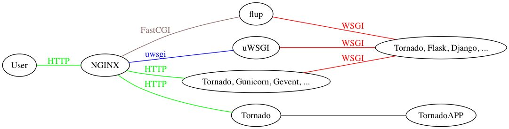

Python web 服务

最开始在天巡接触了tornado，而且用的是下图中最底部的那条线。后来在虾皮开始使用Django。在没有详细对比之前，以为Django和之前用过的Tornado是类似的东西。然而实际Django在上live的时候总是配合着gunicorn来启动，让我有些不太理解，为什么Tronado没有这样做呢？详细查询了资料，感觉下面这张图很好的解开了我的疑惑。


Tornado: HTTP 服务器、WSGI 框架（很少用） 
CGI: 古老的动态 HTTP 服务方式，极其低效、容易出漏洞。Perl 盛行的时代很常用。 
WSGI: Python 的 HTTP 接口协议 
FastCGI: PHP 等的接口协议。PHP 也是唯一一个把 FastCGI 实现得像 CGI 的 FastCGI 实现（HTTP 头可通过环境变量访问） 
uwsgi: 它是一个软件。是 WSGI、PSGI 等等的容器。也就是它实现了这些协议。同样实现了 WSGI 的还有 gunicorn 之类的。 
nginx: 可以作为代理，把 HTTP 传给 Tornado。也可以作为网关，把 HTTP 转成 FastCGI、uwsgi 协议传给后边的程序。 

**reference**:
https://www.cnblogs.com/fengchong/p/10230266.html
https://www.zhihu.com/question/54151743

  一、Tornado
Tornado是一个web框架和异步网络包。Tornado最开始是由FriendFeed开发。FriendFeed这家公司后来被Facebook收购，于2015年关停了服务。

二、Gevent中的协程和Tornado中协程的区别