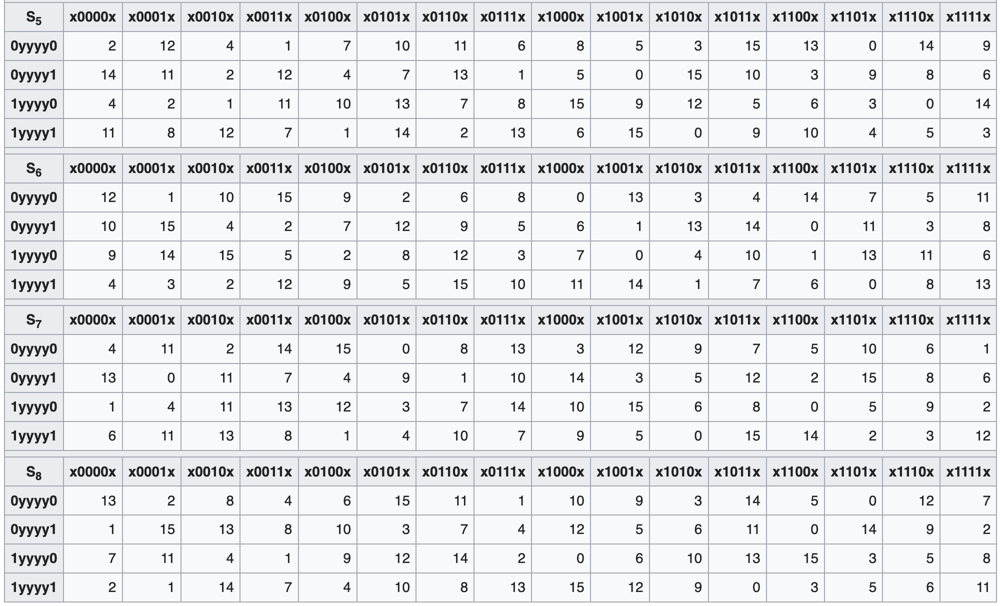

## DES原理简介
Data Encryption Standard。DES是基于块的加密算法。如下图（摘自GeeksforGeeks）所示，明文被分为64bit（8byte）的块，每块分开加密成不同的Block，最后将所有的Block组合在一起，生成密文。其中密钥是一个长56bit（实际是64bit，其中每8bit中有一个是奇偶校验位，奇偶校验的作用就是一定程度保证key在传输过程中没有出现错误，更详细的奇偶校验原理参见[奇偶校验](./奇偶校验.md)）。

如下图所示，DES包含一次IP转换+16轮处理+一次FP转换。IP即Initial Permutation, FP即Final Permutation。IP和FP是两个互逆操作。IP和FP其实对数据加密没有什么实质的作用，他的存在是为了方便在一些硬件设备上更好的输入输出。DES的核心则是这16轮处理过程。每轮开始前，将输入分成长度相同的两部分，即32bit长度。这两部分分别称为左边和右边。当前轮的右边部分经F流程（Feistel Function）处理后和左边部分异或，得到的结果作为下一轮的左边部分，当前轮的左边部分直接作为下一轮的右边部分。

下图是前面提到的F流程的详细过程。F流程包含四个步骤： 
1、扩展，32bit的输入经过扩展后，变成了48bit。扩展的方法是先完整的拷贝32bit，然后每4bit分一组，共计8组。每组再额外加上2bit，这2bit来自左右的临近分组（具体取临近分组的那一bit，目前我还没找到资料）。 
2、Key混合，将key和第一步得到的48bit数据做异或操作。前面提到过DES的key的有效位是56bbit，那这里的48bit长的key是怎么回事呢？这个详细可看下一节。简单的说就是这一步用到的48bitkey是由56bit的主key转换过来的。 
3、替换，第二步得到的结果按每6bit一组分成8组，每一组单独的用S-box进行处理。S-box将6bit的输入通过非线性的转换成4bit。这种非线性的转换主要是通过查找表实现的。S-box是整个DES安全的核心。从理论上讲，S-box目的是为了混淆，隐藏密码和密文之间的关系，防止有人从密文推出密码。8个S-box的输出共计8*4=32bit。 
4、排列，上一步输出的32bit经过重新排列得到一个新的32bit。实现这一步的方法是P转换。该操作的目的是让上一轮S-box的输出在下一轮中扩展到其他不同的S-box。从何达到隐藏明文和暗文之间的关系。 
DES基于密码学中的两个基本特性：[混淆和扩散](./confusion_diffsion.md)。上面的S-box对应着混淆，E和P转换对应扩散。

## KEY
DES的key长64bit，其中56bit是有效位。前文提到的Feistel Function中用到的key是48bit长的。16轮Feistel Function共计需要16个48bit的key。这16个48bit长的key是通过56bit长的主key计算得到的。计算逻辑如下图所示。

1、图中第一步的PC1(Permuted Choice 1)的作用是去掉64bit中的校验位。得到有效的56bit。 
2、56bit的key被分成28bit的两部分。每部分按位向左循环移动1～2位，然后通过PC2（Permuted Choice 2),各得到24bit，合并在一起共计48bit，作为一个subkey。 
3、重复2中的步骤，直到得到16个subkey。 

注意，PC1和PC2是计算的Key的关键。
## S-box
S-box即为Substitution-box. 在对称加密算法中，S-box是实现替换的关键组件。替换即为了实现香农关于混淆的加密特性。正如前文中对S-box的使用，其输入是6bit，输出是4bit。但是要注意，不同的加密算法使用的S-box并不一样，输入和输出的长度也有差别。另外对DES而言，其使用的S-box是固定的。而其他例如Blowfish的S-box则是动态生成的。下面是DES所使用的8个S-box. Biham和Shamir发现这8个S-box中任意一点小小的改动，都会降低DES加密的安全性。

范例：输入是101011，请问使用s2，输出是什么？
101011的外层两个bit是11，内层4个bit是0101，所以在s2表中横坐标是1yyyy1，纵坐标是x0101x，那么对应的输出是9，即1001. 所以101011->1001
## E转换
Feistel Function中有两个输入，一个是32bit的数据，一个是48bit的subkey。二者长度不同，无法直接进行异或操作。所以需要将32bit的数据先进行扩展到48bit。扩展的同时，也实现了部分扩散的功能，即Diffusion。E（Expansion function）转换就是为了实现这个目的。下图是E转换的映射表。

下图则形象的展示了E转换的过程。

## P转换
P转换如下图所示。目的是将32bit的顺序打乱，达到扩散的目的。即Diffusion。

下图形象的展示了P转换的过程。

## reference

[1] https://en.wikipedia.org/wiki/Data_Encryption_Standard#Overall_structure

[2] https://en.wikipedia.org/wiki/DES_supplementary_material

[3] https://en.wikipedia.org/wiki/S-box

