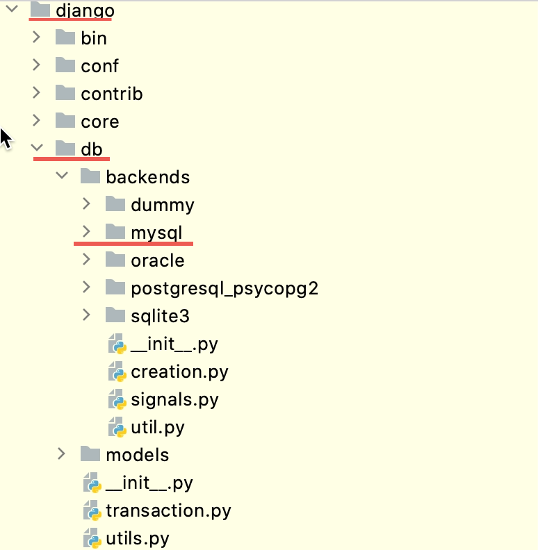
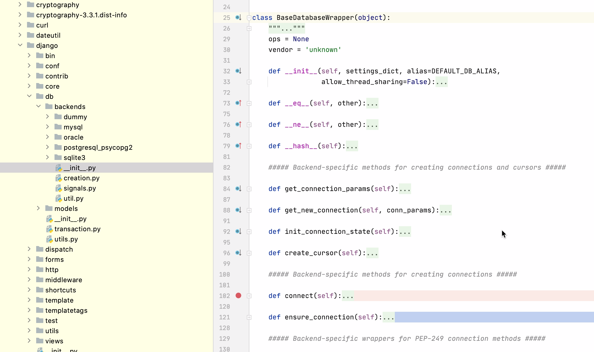
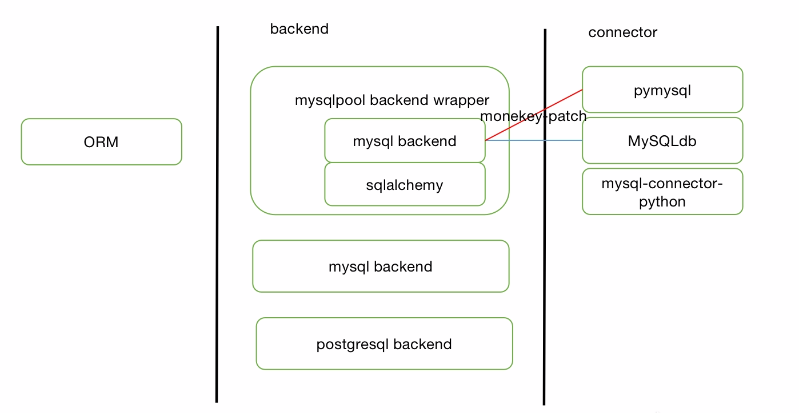

# <center>Python - Mysql数据库连接源码分析</center>

## 一、概要
Django自带ORM组件。通过django的ORM可以很方便地进行数据库操作。Django的ORM包是django.db。文本将从数据库的连接管理、SQL编译、延迟加载等方面研究一下Django ORM。


## 二、数据库连接管理
Django ORM支持包括mysql，oracle，postgresql，sqlite等多种数据库。下面以项目中用到的一种连接管理来探讨mysql的连接管理。

### 2.1 相关的依赖包
涉及到的包：
- django.db （django orm，默认依赖MySQLdb实现数据库连接）
- django.mysqlpool（类似于粘合剂的作用，将pymysql和sqlalchemy粘合起来，实现mysql连接的池化管理）
- pymysql （连接器，用于管理mysql连接）
- sqlalchemy （连接池管理）

### 2.2 依赖包整体解读
#### 2.2.1 概览
下图是django.db包的大概结构。可以看到db下有backends和models两个子module。backends中包含了django支持的所有数据库。而models中则包含的是SQL解析相关内容。这里主要讨论的连接相关的内容都集中在backends中。

下图是backends中的__init__.py文件中定义的BaseDatabaseWrapper，这是数据库包装类的基础类。每个数据库对应的包装类都会继承自这个基础类。


#### 2.2.2 数据库管理
django/db/_\_init__.py中定义了一个全局变量connections，如下所示。connections这个全局的变量是用来管理多个数据库的。在使用上，大可以将connections看作是一个DatabaseWrapper数组来对待（这是因为ConnectionHandler实现了一些魔法方法）。
``` python
connections = ConnectionHandler()
```
在django/db/utils.py中有ConnectionHandler的详细定义。可以看到self._databases的定义来自于settings.DATABASES。

``` python
class ConnectionHandler(object):
    def __init__(self, databases=None):
        """
        databases is an optional dictionary of database definitions (structured
        like settings.DATABASES).
        """
        self._databases = databases
        self._connections = local()

    @cached_property
    def databases(self):
        if self._databases is None:
            self._databases = settings.DATABASES
        if self._databases == {}:
            self._databases = {
                DEFAULT_DB_ALIAS: {
                    'ENGINE': 'django.db.backends.dummy',
                },
            }
        if DEFAULT_DB_ALIAS not in self._databases:
            raise ImproperlyConfigured("You must define a '%s' database" % DEFAULT_DB_ALIAS)
        return self._databases

    def __getitem__(self, alias):
        if hasattr(self._connections, alias):
            return getattr(self._connections, alias)

        self.ensure_defaults(alias)
        db = self.databases[alias]
        backend = load_backend(db['ENGINE'])
        conn = backend.DatabaseWrapper(db, alias)
        setattr(self._connections, alias, conn)
        return conn

    def __iter__(self):
        return iter(self.databases)

    def all(self):
        return [self[alias] for alias in self]
```
这里的settings.DATABASES就是业务代码中设置的DATABASES。如下所示，它本质是一个存有数据库连接信息的字典。
``` python
{
    'abc_db':  {
        # 'ENGINE': 'django.db.backends.mysql',
        'ENGINE': 'django_mysqlpool.backends.mysqlpool',
        'NAME': 'abc_db',
        'HOST': 127.0.0.1,
        'PORT': 3306,
        'USER': root,
        'PASSWORD': 123456,
        'CONN_MAX_AGE': 3600,
        'OPTIONS': {'charset': 'utf8mb4'},
    }
}
```
ConnectionHandler中的_connections是一个local变量，也就是说DatabaseWrapper的实例化是和线程关联起来的。ConnectionHandler的all方法是非常重要的一个方法。她会遍历self.\_databases, 每个遍历的变量名为alias。之后self[alias]会自动调用魔法方法__getitem__，这个方法会根据alias中的数据库连接信息，生成对应的DatabaseWrapper。特别注意的是下面三句。从alias中获取‘ENGINE’，也就是对应的数据库类路径。由上面贴出来的配置可知，ENGINE配置的是django_mysqlpool.backends.mysqlpool。后面将连接管理的部分会详细讲解这块。
``` python
db = self.databases[alias]
backend = load_backend(db['ENGINE'])
conn = backend.DatabaseWrapper(db, alias)
```
综上，得出下面两点重要结论
- 可以认为全局变量connections是数据库管理的核心，若把它看作一个list，它里面是可以同时存放不同类型的数据库对象。例如,<br>
 [Mysql_DB1, Mysql_DB2, PostgreSQL_DB1, Oracle_DB1]<br>
- ConnectionHandler获取database信息是django orm和业务代码的一个交点。光说使用django orm的话，知道了这一点就足够了。

#### 2.2.3 连接池管理
在2.2.2小节中提供的数据库连接信息中可以看到，DATABASE中的ENGINE配置的是[django_mysqlpool.backends.mysqlpool](https://pypi.org/project/django-mysqlpool/#description)。而实际上django自带的bankends并没有mysqlpool。它是一个由smartfile公司开发的扩展包。这里之所以称之为扩展包，是因为mysqlpool是通过moneky-patch django mysql backend的方式工作的。也就是说，实际的的连接管理还是由django mysql backend来实现的。mysqlpool只是多做了一部分连接池化的工作。<br>
下面是mysqlpool的部分代码。其实mysqlpool整个包就一个base.py文件，总代码量不足100行，那它是如何实现池化的？它又是如何在django mysql backend上打moneky-patch的呢？
- 回答第一个问题，要看下面代码中的MYSQLPOOL定义。它是通过调用pool.manage得到的。也就是说真正的pool定义以及pool的实现都是在[sqlalchemy](https://www.sqlalchemy.org/)之中。mysqlpool是一个拿来主义信徒。<br>
- 对于第二个问题，主要有三个点:
<br>1、DatabaseWrapper = base.DatabaseWrapper,这句将django mysql backend中的DatabaseWrapper直接暴露到mysqlpool中。这样使用mysqlpool中的DatabaseWrapper就是使用Django mysql backend中的DatabaseWrapper。这样做的原因是因为django中的backend都需要有DatabaseWrapper这个类来表示数据库（BaseDatabaseWrapper作为基类，起到了接口的作用）。mysqlpool本来就是对django mysql backend的monkey-patch，所以直接用相同的定义即可。
<br>2、OldDatabase = OldDatabaseProxy(base.Database.connect)这句将django mysql backend的connect方法包装起来，使得在get_pool().connect(**kwargs)中能调用base.Database.connect来建立数据库连接。
<br>3、base.Database.connect = connect 这句的意义在于，mysqlpool用的DatabaseWrapper中建立新连接的方法叫get_new_connection()。如下面第二段代码所示，其中关键的一句是conn = Database.connect(**conn_params)。正常情况下Database.connect应该是直接建立连接，但是这里引入了pool，而要让普通的connect变成从pool中获取一个连接，必须将base.Database.connect指向mysqlpool自定义的connect。

```python
import sqlalchemy.pool as pool

# Define this here so Django can import it.
DatabaseWrapper = base.DatabaseWrapper

# Wrap the old connect() function so our pool can call it.
OldDatabase = OldDatabaseProxy(base.Database.connect)

def get_pool():
    "Creates one and only one pool using the configured settings."
    global MYSQLPOOL
    if MYSQLPOOL is None:
        backend = getattr(settings, 'MYSQLPOOL_BACKEND', MYSQLPOOL_BACKEND)
        backend = getattr(pool, backend)
        kwargs = getattr(settings, 'MYSQLPOOL_ARGUMENTS', {})
        kwargs.setdefault('poolclass', backend)
        # The user can override this, but set it by default for safety.
        kwargs.setdefault('recycle', MYSQLPOOL_TIMEOUT)
        MYSQLPOOL = pool.manage(OldDatabase, **kwargs)
        setattr(MYSQLPOOL, '_pid', os.getpid())
    if getattr(MYSQLPOOL, '_pid', None) != os.getpid():
        pool.clear_managers()
    return MYSQLPOOL

def connect(**kwargs):
    "Obtains a database connection from the connection pool."
    conv = kwargs.pop('conv', None)
    if conv:
        # SQLAlchemy serializes the parameters to keep unique connection parameter
        # groups in their own pool. We need to store conv in a manner that is
        # compatible with their serialization.
        kwargs['conv'] = HashableDict(conv)
    # Open the connection via the pool.
    return get_pool().connect(**kwargs)

# Monkey-patch the regular mysql backend to use our hacked-up connect() function.
base.Database.connect = connect
```
下面这段代码在使用Database.connect的时候，实际上就会调用上一段代码中的connect。
```python
import MySQLdb as Database

class DatabaseWrapper(BaseDatabaseWrapper):
    def get_new_connection(self, conn_params):
        conn = Database.connect(**conn_params)
        conn.encoders[SafeText] = conn.encoders[six.text_type]
        conn.encoders[SafeBytes] = conn.encoders[bytes]
        return conn
```

那sqlalchemy又是什么呢？它其实是一个python SQL工具包+ORM组合体。仅仅用sqlalchemy的功能也可以实现数据库的增删改查功能，廖雪峰网站上有相关[教程](https://www.liaoxuefeng.com/wiki/1016959663602400/1017803857459008)。那django为什么没有直接用sqlalchemy？这应该是一个工程学的问题。django想将ORM做成一个比较通用的模块，可以适配各种不同的数据库，那么它必须有自己的标准，这个标准就是django.db中定义的BaseDatabaseWrapper。很显然，这个标准和sqlaclchemy并不契合。那要使用sqlalchemy的功能就需要mysqlpool这个粘合剂的作用了。
<br>
接着展开讲一下Database.connect(**conn_params)中的Database，根据import我们知道它是从MySQLdb的别名。那MySQLdb又是什么呢？

#### 2.2.4 连接管理
查阅了一些网站，有些称连接管理的工具包为connector，还有些称之为adapter或[DB API](https://www.python.org/dev/peps/pep-0249/)。这些叫法都是从不同的角度叫出来的名字。connector是从使用的角度看，是一个连接器。adapter是从orm和数据库之间关系的角度看的。DB API是从python规范[PEP249](https://www.python.org/dev/peps/pep-0249/)的角度看的。本文统一称为connector。目前主流的connector有3个,python开发连接Mysql基本上都绕不开这三个包。
- [MySQLdb](https://github.com/PyMySQL/mysqlclient)
- [pymysql](https://github.com/PyMySQL/PyMySQL)
- [mysql-connector-python](https://github.com/mysql/mysql-connector-python)

MySQLdb比较特别一些，它是在一个实现了DBAPI的C语言包的基础包装了一下。而且MySQLdb有MySQLdb1和MySQLdb2两个已经废弃的历史版本，最新的版本(基于MySQLdb1 fork的版本)也移到[mysqlclient仓库](https://github.com/PyMySQL/mysqlclient)中去了。这个变化同样体现在django.db包之中，如下面两段代码分别是django 1.6.11和django 4.0.2中对MySQLdb引入后报错的文案提示。可见最新的MySQLdb已经默认是mysqlclient了。
```python django 1.6.11
try:
    import MySQLdb as Database
except ImportError as e:
    from django.core.exceptions import ImproperlyConfigured
    raise ImproperlyConfigured("Error loading MySQLdb module: %s" % e)
```
```python django 4.0.2
try:
    import MySQLdb as Database
except ImportError as err:
    raise ImproperlyConfigured(
        "Error loading MySQLdb module.\nDid you install mysqlclient?"
    ) from err
```
值得注意的是[mysqlclient](https://github.com/PyMySQL/mysqlclient)和[pymysql](https://github.com/PyMySQL/PyMySQL)在github中同属于一个组织。前面也提到过mysqlclient是基于C语言包装的，而pymysql是一个纯python库，这也导致mysqlclient的性能比pymysql的要好。django默认是使用MySQLdb的<br>
[mysql-connector-python](https://github.com/mysql/mysql-connector-python)则是Mysql官方提供的connector。<br>
[PEP249](https://www.python.org/dev/peps/pep-0249/) 这个规范规定了python连接Mysql的接口。pymsql和mysql-connector-python都遵循了PEP249。[深入了解PEP249](./pep249.md)有助于理解pymsql和mysql-connector-python的实现。

#### 2.2.5 小结
django的模式是为backend定义一套接口，backend再在此接口的定义之上用其他的connector来实现数据库的连接。django.db, pymysql, mysqlpool, sqlalchemy，这些包之间就像插座、插头、插头转换器一样连接在了一起，实现了一个完整的功能。本文主要是从全局的角度介绍了各个组件的功能，以及它们之间是如何连接在一起的。而实际的使用过程中，因为情况不同，可能用哪些包，怎么用，都会是另一番天地。<br>

PS:
MySQLdb的历史过于复杂。还存在很多fork的版本，例如[django-mysql-pymysql](https://github.com/clelland/django-mysql-pymysql)也是其一。所以关于MySQLdb的历史可以不要过多关注。

### 三、sqlalchemy的连接池解读
3.1 连接池的使用


3.2 连接池对象


### 四、pymysql的数据库连接解读
4.1 连接的使用


4.2 连接对象解析


### 五、django SQL编译


### 六、案例分析


### 七、综述


