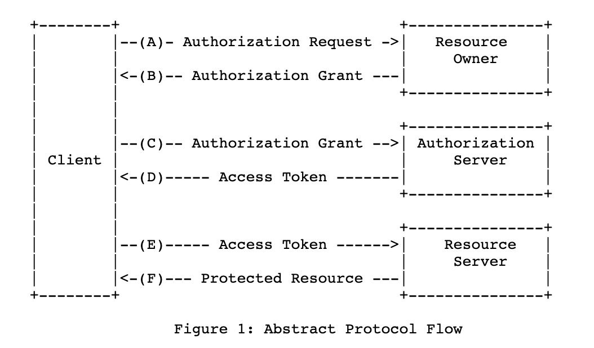

## OAuth2

### 一、定义
OAuth2是一个授权框架，或者说是一个标准，[规范RFC6749](https://datatracker.ietf.org/doc/html/rfc6749). 它使得第三方应用能够以资源所有者的身份或者第三方应用自己的身份来获取目标应用的部分权限。

下面是OAuth2的流程示意。需要注意的是，不同的厂商，在实现该框架的时候会有一些差别，并不一定完全是图中所示的流程。

### 二、场景
一个常用的场景是，你希望在一个打印照片的网站A打印自己存储在网站B中的照片，而又不希望网站A知道自己在网站B的用户名和密码，这时候，可以引入授权层来完成这个事情。Oauth2就是这样一个授权框架。

另外一个常用的场景是利用Oauth2授权来实现免注册登陆。

### 三、Grant Type
- 1、 Authorization code （目前People的系统基本都是这种方式， https://developer.okta.com/blog/2018/04/10/oauth-authorization-code-grant-type）
- 2、Implicit flow             （简化版，token直接返回，而不是通过code来交换）
- 3、password Grant      （用户名和密码都告诉给client。只有对Client充分信任的时候，才可以采用这种方式）
- 4、Client Credentials   （client本身有权限，可以让client代替用户来访问资源）
- 5、PKCE (proof key of code exchange) 这个主要是app或者桌面应用无法像web应用那样在server端用一个固定的client_secret来防止authorization code被中间人盗窃。所以使用一个动态生成secret的方式来完成认证流程。

### 四、Authoriztion Code
Authorization Code授权类型一般用于Web或者移动APP。

Authorization Request虽然在图示中是给Resource Owner的。但是Client一般可以认为是一个Brower+后台，它是如何知道要向Resource Owner发什么样的Authorization Request？所以实际实现的时候，这里往往有两步，第一步是client把Authorization Request发给Authorization Server，在Authorzation Server的页面向Resource Owner提出授权申请？

### 五、PKCE（Proof Key of Code Exchange)
Authoriztion Code在移动设备上，client secret可能会被同机器的其他应用窃取（client secret会存储在ROM中）。所以PKCE采取直接在内存中生成一个临时的secret的方式来替代原来的client secret。其安全性体现在各个应用内存的隔离。PKCE生成的临时secret叫做：codeVerifier

### 六、reference

- https://developer.okta.com/blog/2018/04/10/oauth-authorization-code-grant-type
- https://oauth.net/2/grant-types/
- https://www.oauth.com/oauth2-servers/background/
