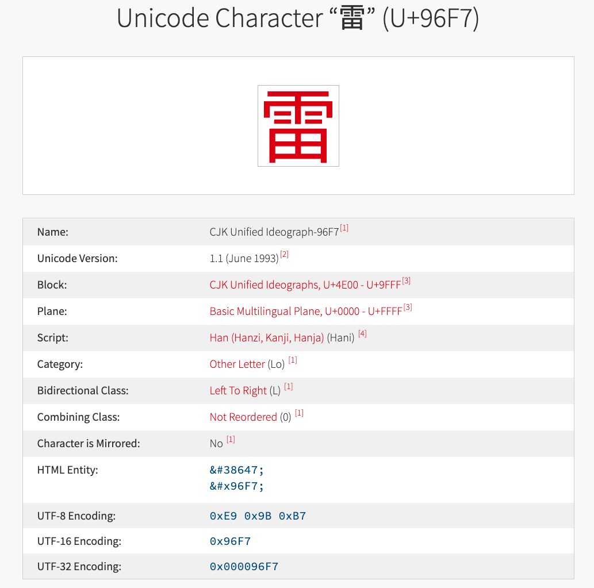

### 字符集

### Unicode
Unicode使用数字0到0x10ffff来表示所有的字符。也就是说Unicode目前包含的字符不超过256*256*17=1114112，大概100万。不过实际世界上并没有这么多个字符，这1114112个数字中还存在一些未编好，或预留做私人用途的数字。
一般的，这些数字被称为代码点(英文为：Code Point)。注意，代码点要和编码区分开理解。如下图，‘雷’的Unicode是U+96F7，也就是代码点是U+96F7.而utf-8，utf-16和utf-32的编码则分别是‘0xE9 0x9B 0xB7’，‘0x96F7‘，’0x000096F7‘。
Unicode中几个关键概念。
- Code Space: 0到10FFFF定义了Code Space， 也可以叫做Code Points，每个数字就是一个Code Point。
- Plane：中文理解就是平面，总共有17个，编号0-16。其实就是将Code Space分为17个组。其中0号是基础平面（BMP），基本包含了平时我们会用到的所有字符。所有BMP中的Code Points都可以用一个utf-16编码单元表示。
- Block：每一个Plane会根据字符间的相关性细分为好几个Block。
- Script：可以理解为书写系统，或者语言。例如中文书写系统，中文。截止2021年，uicode已经包含了159个script。

Unicode的更多的详细内容可以参考[1][2]

#### utf-32

#### uft-16

#### uft-8

### reference
[1] [https://en.wikipedia.org/wiki/Unicode](https://en.wikipedia.org/wiki/Unicode)

[2] [https://unicode-table.com/en/#high-surrogates](https://unicode-table.com/en/#high-surrogates)

[3] [https://zhuanlan.zhihu.com/p/51202412](https://zhuanlan.zhihu.com/p/51202412)

[4] [https://unicode.org/faq/utf_bom.html](https://unicode.org/faq/utf_bom.html)

