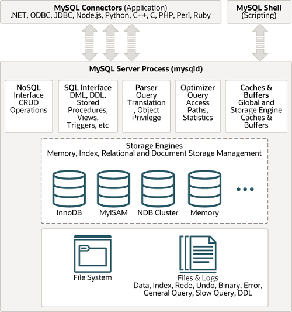
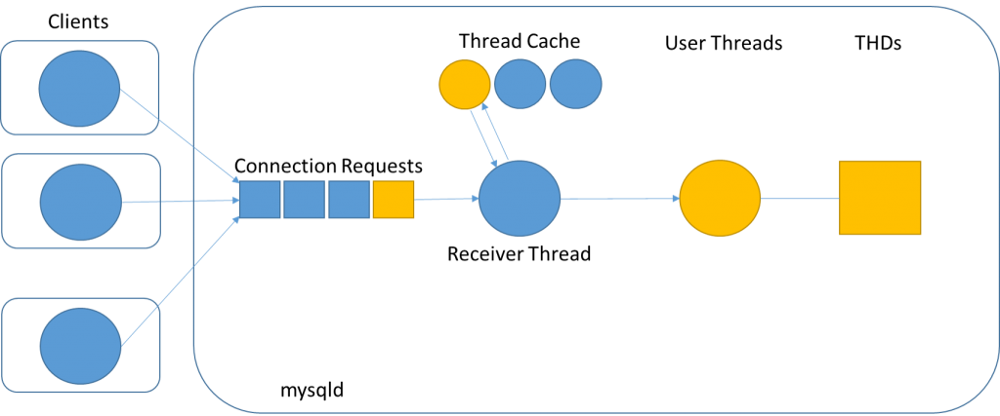

### 简介
MySQL是由瑞典公司MySQL AB用c和c++开发和支持的。主要由Michael和David开发。有些说法说MySQL是以Michael的女儿的名字命名的。

### 图解
下图是从GE[1](#ref1)上下载的。该图比较简单，但是可以快速了解MySQL服务端的整体架构。
 

下图是从MySQL官网[2](#ref2)上下载的。改图中的组件及相应的功能写的比较详细。可以作为深入了解MySQL服务端架构的图解。

### 组件
Mysql中的组件非常多，大概分为2大类。第一类是Application Layer，可以理解比较通用的组件都在这一层。第二层是服务层，这一层包含Mysql的逻辑相关的功能组件。 
一、Application Layer 
1、Connection Handling 
当客户端和mysql服务端建立连接的时候，服务端会专门为其建立一个线程来处理连接。连接涉及到的对象有receiver thread, user thread, thread cache, THD. 请求进入Mysql server之后会在请求队列中排队。receiver thread则专门负责从队列取出请求，并创建user thread来处理该请求。当然如果thread cache中刚好有空闲线程的话，receiver thread会把请求交给某个空闲的线程处理。值得注意的是，MySQL自身没有实现线程，它依赖于操作系统的线程。当user thread收到一个请求的时候，它会为之创建一个THD，THD就是一个用来表示一个连接的数据结构。当连接断开的时候，会销毁THD。

Mysql对短连接（每次重建连接）的支持非常好。能达到每秒80000次的连接。
Mysql同样支持长连接。与短连接不同的是：重用连接。不过受max_connections系统变量限制。
Thread Cache用于User Thread池化。这个有助于减少用户线程创建的开销。

2、Authentication
认证基于用户名、客户端HOST、密码来进行的。

3、Security
当认证通过并成功建立连接之后，mysql server需要检查该客户端有权限做哪些操作。可以通过show privileges查看。

二、Server Layer 
server layer包含了mysql所有的逻辑功能。 
1、Mysql service and utilities 
2、SQL interface 
3、SQL Parser 
4、Optimizer 
5、Caches&buffers 

### Reference

[1][https://www.geeksforgeeks.org/architecture-of-mysql/](https://www.geeksforgeeks.org/architecture-of-mysql/)

[2][https://dev.mysql.com/doc/refman/8.0/en/pluggable-storage-overview.html](https://dev.mysql.com/doc/refman/8.0/en/pluggable-storage-overview.html)

[3][https://www.rathishkumar.in/2016/04/understanding-mysql-architecture.html](https://www.rathishkumar.in/2016/04/understanding-mysql-architecture.html)

